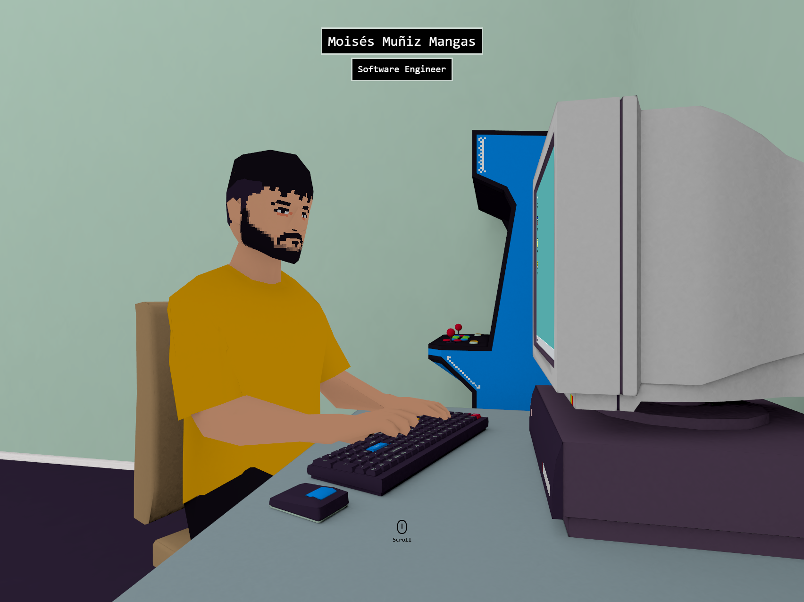

# 🎨 Moi's 3D Portfolio

This project is an **interactive 3D portfolio**, featuring a retro-inspired environment.

---

## 🚀 Built With

---

## 🔐Available Scripts

In the project directory, you can run:

### `npm start`

Runs the app in the development mode.\
Open [http://localhost:3000](http://localhost:3000) to view it in your browser.

The page will reload when you make changes.\
You may also see any lint errors in the console.

### `npm run predeploy`

Builds the app for production to the `build` folder.\
It correctly bundles React in production mode and optimizes the build for the best performance.

The build is minified and the filenames include the hashes.\
Your app is ready to be deployed!

### `npm run deploy`

Deploys the app to **GitHub Pages** using the `gh-pages` branch. \
Make sure your repository is correctly configured with the `homepage` field in `package.json` before running this command.
